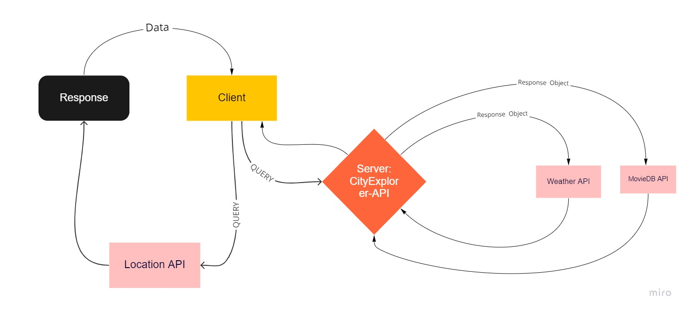
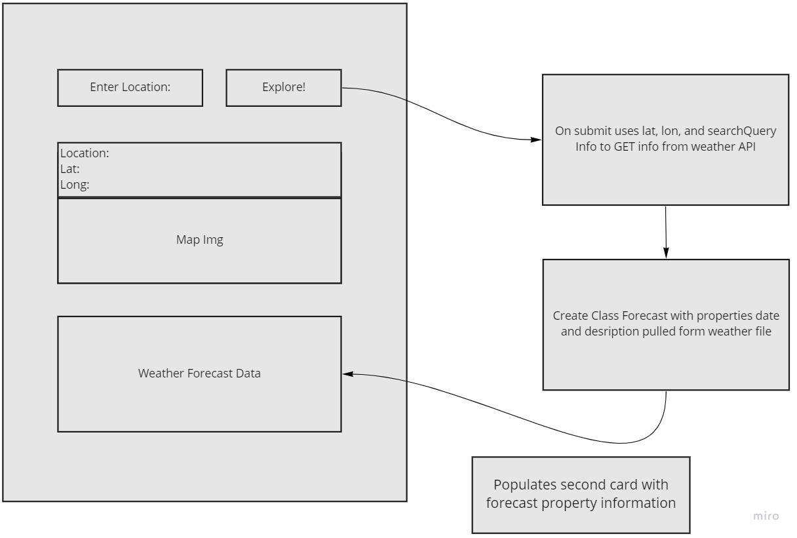
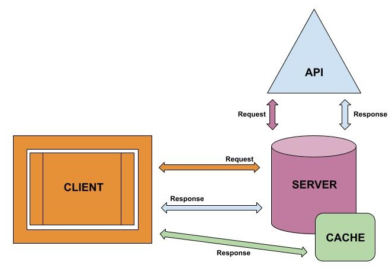

# city-explorer-api

**Author**: Andrew Schiller

**Version**: 1.0.0

## Overview
An extension of the City Explorer project, which now adds server connections (instead of APIs) to provide weather data for queried cities.

## Getting Started
<!-- What are the steps that a user must take in order to build this app on their own machine and get it running? -->

## Architecture

- ### **core languages:** HTML/CSS/JavaScript

- ### **library:** [React Bootstrap](https://react-bootstrap.github.io/getting-started/introduction)

## Change Log
1.  **Display weather data for a given city**
    - Estimated ETA: 120
    - Start time: 7:15-9:00
    - Finish time: 
    - Actual ETA: 

1. **Display map of a given city**
1. **Display 3-day forecast for a given city**
1. **Display 20 movies associated with a given city**

## Credit and Collaborations

- [Jonathan Rumsey](https://github.com/nojronatron) contributed to the Lab 6 data flow plan
- Abdulahi Mohamud contributed to the Lab 7 data flow plan
- Raul Zarate and Roger Reyes contributed to the Lab 8 data flow plan
- Roger Reyes contributed to the Lab 9 data flow plan
- Jason Wilson contributed to the Lab 10 data flow plan