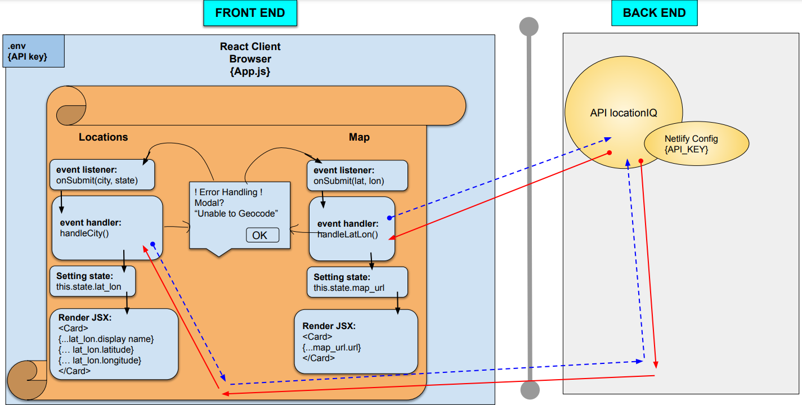
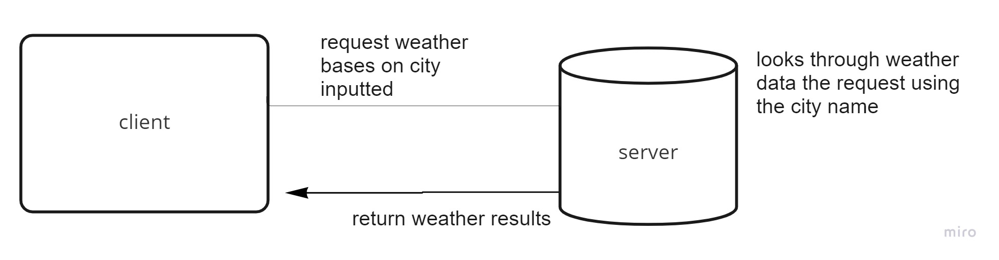

# city-explorer-api

**Author**: Andrew
**Version**: 1.0.0 (increment the patch/fix version number if you make more commits past your first submission)

## Overview
An extension of the City Explorer project, which now adds server connections (instead of APIs) to provide weather data for queried cities.

## Getting Started
<!-- What are the steps that a user must take in order to build this app on their own machine and get it running? -->

## Architecture

- ### core languages: HTML/CSS/JavaScript

- ### library: [React Bootstrap](https://react-bootstrap.github.io/getting-started/introduction)

## Change Log
- Name of feature: Display weather data for a city
- Estimated ETA: 120
- Start time: 7:15-9:00
- Finish time: 
- Actual ETA: 

## Credit and Collaborations
Abdulahi contributed to the wireframe